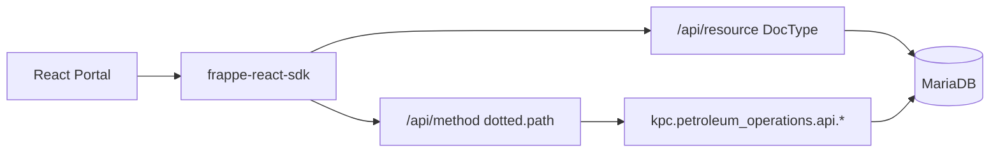

# KPC Portal — Page-wise API & Data Map

Meeting handout: **page → what is called → DocType vs custom API → what data comes back**.

Basename: `/portal`. All HTTP goes through **`frappe-react-sdk`** (no axios/fetch service layer). DocType name constants live in [`src/constants/doctype.string.ts`](../src/constants/doctype.string.ts).

---

## How the portal talks to Frappe

| Call type | SDK hook | Under the hood |
| --- | --- | --- |
| DocType list | `useFrappeGetDocList` | `GET /api/resource/{DocType}` |
| DocType count | `useFrappeGetDocCount` | resource count / `frappe.client.get_count` |
| Custom / RPC GET | `useFrappeGetCall('dotted.method')` | `GET/POST /api/method/{method}` |
| Custom / RPC POST | `useFrappePostCall` | `/api/method/...` |
| Update doc | `useFrappeUpdateDoc` | REST PATCH resource |
| Auth | `useFrappeAuth` | session login / logout / `currentUser` |

**Call type legend used below**

| Label | Meaning |
| --- | --- |
| **Custom** | Whitelisted `kpc.petroleum_operations.api.*` method |
| **DocType** | Standard Frappe resource list/count |
| **Core RPC** | Standard Frappe method (e.g. `frappe.client.get_list`, `frappe.client.set_value`) |
| **Auth** | Session login/logout |
| **Dummy** | Static/local data only — no live Frappe call |

---

## A. Overview (all routes)

| Page / Route | Live? | Custom APIs | DocTypes | Notes |
| --- | --- | --- | --- | --- |
| Login `/login` | Auth only | — | — | `useFrappeAuth().login` |
| Executive Command `/` | Live | `get_pipeline_scada_network` | Journey, Oil Shipment, Permit to Work, AI Alert, Terminal Receipt, Oil Tank, Invoice, Reconciliation, Pipeline Batch, Allocation, Tariff, Capacity Assessment, Nomination | KPIs + charts + 3D SCADA + alerts |
| Pipeline Flow `/pipeline-flow` | Partial | — | Movement, Pipeline Batch | Flow diagram is **dummy** |
| Stock & Tank Farm `/stock-tank-farm` | Live | `get_stock_movement` (via card) | Oil Tank, Tank Measurement, Stock Movement, Reconciliation, Inventory Position, Terminal Receipt, Dispatch | Includes overview tank/stock cards |
| Loss & Accountability `/loss-accountability` | Partial | `get_loss_accountability_kpis` | Reconciliation, Variance (revalidate only) | Heatmap / cause chart / segment table = **dummy** |
| Commercial & Revenue `/commercial-revenue` | Live | — | Invoice, Allocation, Tariff | Metrics derived client-side |
| Assets & EAM `/assets-eam` | Live | `get_uptime_and_cost_summary` | Plant Asset, Maintenance Work Order | **Only write path** in portal (WO status) |
| HSE & Integrity `/hse-integrity` | Dummy | — | — | `features/hse-integrity/data/dummy.ts` |
| Daily Throughput `/reports/daily-throughput` | Live (+ fallback) | `reports.get_daily_throughput_report` | Pipeline Batch, Movement, Terminal Receipt | Prefer custom; DocList fallback |
| Stock Reconciliation `/reports/stock-reconciliation` | Live (+ fallback) | `reports.get_stock_reconciliation_report` | Oil Tank, Tank Measurement | Prefer custom; DocList fallback |
| Product Loss `/reports/product-loss` | Live (+ fallback) | `reports.get_product_loss_report` | Reconciliation, Variance, Pipeline Batch | Prefer custom; DocList fallback |
| Tariff Revenue `/reports/tariff-revenue` | Live (+ fallback) | `reports.get_tariff_revenue_report` | Invoice | Prefer custom; DocList fallback |
| HSE Compliance `/reports/hse-compliance` | Dummy | — | — | Dummy report data |

---

## B. Page-by-page detail

### 1. Login — `/login`

**File:** `src/pages/login/index.tsx`

| UI / component | Call type | Method or DocType | Fields / params | Data used for |
| --- | --- | --- | --- | --- |
| Login form | Auth | `useFrappeAuth().login` | `{ username, password }` | Session cookie; navigate to `/` |
| Site header (global) | Auth | `logout()` | — | Clear session |
| `PrivateGuard` / `PublicGuard` | Auth | `currentUser` | — | Route gating (Guest → login) |

---

### 2. Executive Command — `/`

**Files:** `src/pages/home/index.tsx`, `components/*`, `hooks/use-pipeline-scada-network.ts`

| UI / component | Call type | Method or DocType | Fields / params | Data used for |
| --- | --- | --- | --- | --- |
| Home KPIs | DocType count | `Journey`, `Oil Shipment`, `Permit to Work` | counts | Chip / safety KPIs |
| Home KPIs | DocType count | `AI Alert` | filter `status=Open` | Open alerts count |
| Home KPIs | DocType list | `Terminal Receipt` | `net_standard_volume_kl`, `gross_observed_volume_kl` | Throughput KPI |
| Home KPIs | DocType list | `Oil Tank` | `safe_fill_capacity_kl`, `current_state` | Line fill / storage |
| Home KPIs | DocType list | `Invoice` | `grand_total`, `currency`, `docstatus` | Revenue MTD |
| Home KPIs | DocType list | `Reconciliation` | `variance_*`, `within_tolerance`, `tolerance_percent` | System loss |
| `LiveAlerts` | Core RPC | `frappe.client.get_list` on `AI Alert` | `severity`, `count(name)`; `group_by: severity` | Severity tab counts |
| `LiveAlerts` | DocType list | `AI Alert` | alert fields; severity filter; page size 5 | Alert feed |
| `NetworkMap3D` via `usePipelineScadaNetwork` | **Custom** | `kpc.petroleum_operations.api.get_pipeline_scada_network` | none | Terminals, tanks, telemetry, segments for 3D map |
| `ThroughputTrendChart` | DocType list | `Terminal Receipt`, `Pipeline Batch` | volumes + dates | 7-day trend |
| `ProductMixChart` | DocType list | `Oil Tank`, `Pipeline Batch`, `Allocation` | product volumes | Product mix |
| `RevenueVsTargetChart` | DocType list | `Invoice`, `Tariff`, `Capacity Assessment`, `Pipeline Batch`, `Nomination` | totals / rates / capacity | Actual vs target revenue |

---

### 3. Pipeline Flow — `/pipeline-flow`

**Files:** `src/features/pipeline-flow/components/*`

| UI / component | Call type | Method or DocType | Fields / params | Data used for |
| --- | --- | --- | --- | --- |
| `FlowKpis` | DocType list | `Movement`, `Pipeline Batch` | status, flow rates, volumes | Derived KPIs |
| `ActiveBatchesTable` | DocType list + count | `Pipeline Batch` | schedule fields; paginated + filters | Active batch table |
| Product flow diagram / 3D | **Dummy** | — | — | Static visualization |

---

### 4. Stock & Tank Farm — `/stock-tank-farm`

**Files:** `src/pages/stock-tank-farm/index.tsx`, overview cards reused from `src/features/overview/components/`

| UI / component | Call type | Method or DocType | Fields / params | Data used for |
| --- | --- | --- | --- | --- |
| Page KPIs / tank list | DocType list | `Oil Tank` | code, terminal, product, capacity, state | Master tank data |
| Page KPIs | DocType list | `Tank Measurement` | level, temp, NSV, datetime | Latest dip per tank |
| Page KPIs | DocType list | `Stock Movement` | `movement_type`, `quantity_kl`, `status` | Activity KPI |
| Page KPIs | DocType list | `Reconciliation` | `variance_kl`, `variance_percent`, `status` | Net variance KPI |
| `TankFarm3DSection` | DocType list | `Oil Tank`, `Tank Measurement` | tank + measurement fields | 3D tank farm |
| `TankReconciliationCard` | DocType list | `Oil Tank`, `Tank Measurement`, `Inventory Position` | book vs physical | Reconciliation card |
| `StockMovementCard` | **Custom** | `kpc.petroleum_operations.api.get_stock_movement` | optional `terminal`, `date`, `tank` | Opening / receipts / deliveries / losses / closing |
| `StockMovementCard` (fallback) | DocType list | `Inventory Position`, `Terminal Receipt`, `Dispatch` | volumes | Client-side fallback if API thin |

---

### 5. Loss & Accountability — `/loss-accountability`

**Files:** `src/features/loss-accountability/hooks/use-loss-kpis.ts`, charts/tables under `components/`

| UI / component | Call type | Method or DocType | Fields / params | Data used for |
| --- | --- | --- | --- | --- |
| KPI cards via `useLossKpis` | **Custom** | `...api.loss_accountability.get_loss_accountability_kpis` | `{ period: 'MTD' }` | Five KPI cards; falls back to dummy if empty |
| Soft revalidation | DocType list | `Reconciliation`, `Variance` | variance fields (mutate only) | Refresh triggers |
| Heatmap / cause chart / segment table | **Dummy** | `features/loss-accountability/data/dummy.ts` | — | Charts & tables not live yet |

---

### 6. Commercial & Revenue — `/commercial-revenue`

**File:** `src/features/commercial-revenue/hooks/use-commercial-metrics.ts`

| UI / component | Call type | Method or DocType | Fields / params | Data used for |
| --- | --- | --- | --- | --- |
| `useCommercialMetrics` | DocType list | `Invoice` | customer, totals, dates; `docstatus=1` | Revenue / aging metrics |
| `useCommercialMetrics` | DocType list | `Allocation` | customer, product, allocated qty | Volume by customer/product |
| `useCommercialMetrics` | DocType list | `Tariff` | `rate_per_kl`, product, currency | Rate lookup |
| Child charts / tables | — | (context only) | — | No extra API calls |

---

### 7. Assets & EAM — `/assets-eam`

**Files:** `src/features/assets-eam/components/*`

| UI / component | Call type | Method or DocType | Fields / params | Data used for |
| --- | --- | --- | --- | --- |
| `AssetsKpis` | DocType count | `Plant Asset` | total (≠ Decommissioned), Operational | Fleet size / uptime ratio |
| `AssetsKpis` | DocType count | `Maintenance Work Order` | open, emergency, overdue PM, completed breakdowns | WO / MTBF KPIs |
| `WorkOrdersKanban` | DocType list | `Maintenance Work Order` | kanban fields | Board columns |
| `WorkOrdersKanban` (write) | Core RPC | `frappe.client.set_value` | `{ doctype, name, fieldname: execution_status, value }` | Drag / status change |
| `WorkOrdersKanban` (write fallback) | DocType update | `useFrappeUpdateDoc` | `{ execution_status }` | Fallback write |
| `UptimeCostChart` | **Custom** | `kpc.petroleum_operations.api.get_uptime_and_cost_summary` | `{ months: 6 }` | Uptime % + downtime cost series |
| `CriticalAssetsTable` | DocType list | `Plant Asset`, `Maintenance Work Order` | cross-joined health | Critical assets table |

---

### 8. HSE & Integrity — `/hse-integrity`

| UI / component | Call type | Method or DocType | Fields / params | Data used for |
| --- | --- | --- | --- | --- |
| Entire page | **Dummy** | `features/hse-integrity/data/dummy.ts` | — | No Frappe API calls |

---

### 9. Reports

All four live reports: **prefer custom API**, else derive from DocList (+ dummy baselines on the server where needed).

#### Daily Throughput — `/reports/daily-throughput`

**Hook:** `src/features/reports/hooks/use-daily-throughput-report.ts`

| Call type | Method or DocType | Params / fields | Data used for |
| --- | --- | --- | --- |
| **Custom** | `...api.reports.get_daily_throughput_report` | optional `{ date }` | rows / footer / meta |
| DocType fallback | `Pipeline Batch`, `Movement`, `Terminal Receipt` | volumes, dates | Client fallback when API empty |

#### Stock Reconciliation — `/reports/stock-reconciliation`

**Hook:** `use-stock-reconciliation-report.ts`

| Call type | Method or DocType | Params / fields | Data used for |
| --- | --- | --- | --- |
| **Custom** | `...api.reports.get_stock_reconciliation_report` | optional `{ terminal, date }` | book vs physical per tank |
| DocType fallback | `Oil Tank`, `Tank Measurement` | capacity, NSV | Client fallback |

#### Product Loss — `/reports/product-loss`

**Hook:** `use-product-loss-report.ts`

| Call type | Method or DocType | Params / fields | Data used for |
| --- | --- | --- | --- |
| **Custom** | `...api.reports.get_product_loss_report` | `{ period }` | segment loss vs EPRA band |
| DocType fallback | `Reconciliation`, `Variance`, `Pipeline Batch` | variance / throughput | Client fallback |

#### Tariff Revenue — `/reports/tariff-revenue`

**Hook:** `use-tariff-revenue-report.ts`

| Call type | Method or DocType | Params / fields | Data used for |
| --- | --- | --- | --- |
| **Custom** | `...api.reports.get_tariff_revenue_report` | `{ period }` | OMC billing / aging table |
| DocType fallback | `Invoice` | customer, totals | Client fallback |

#### HSE Compliance — `/reports/hse-compliance`

| Call type | Notes |
| --- | --- |
| **Dummy** | No Frappe API — report dummy data only |

---

### 10. Unrouted overview feature (not in router)

`src/pages/overview/index.tsx` is **not** mounted in `private-route.tsx`. Stock Tank Farm reuses some of its components. If composed later:

| Component | Live? | APIs |
| --- | --- | --- |
| `hero-kpi.tsx` | Yes | Journey, Terminal Receipt, Oil Shipment, Pipeline Batch, AI Alert, Reconciliation, Invoice, Oil Tank, Inventory Position, Movement |
| `stock-movement-card.tsx` | Yes | Custom `get_stock_movement` + Inventory Position / Terminal Receipt / Dispatch |
| `thread-tracker.tsx` | Yes | Journey, Oil Shipment, AI Alert |
| Tank farm sections | Yes | Oil Tank + Tank Measurement |
| `ai-section`, `commercial-section`, `hseq-section`, `decision-ledger` | Hardcoded | No API |

---

## C. Custom API appendix

Backend package: [`kpc/petroleum_operations/api/`](../../kpc/petroleum_operations/api/).  
`__init__.py` re-exports all 8 methods, so **short** and **module-qualified** paths both work.

HTTP form: `/api/method/<dotted.path>`

### C.1 Portal-facing (8)

#### 1. `get_pipeline_scada_network`

| Item | Content |
| --- | --- |
| Paths | `kpc.petroleum_operations.api.get_pipeline_scada_network` · `...api.scada_network.get_pipeline_scada_network` |
| File | `scada_network.py` |
| Params | none |
| Reads | Terminal, Oil Tank, Tank Measurement, Inventory Position, Movement, OT Telemetry Log |
| Returns | `{ terminals: [...], telemetry: {...}, segments: [...] }` |
| Portal | `/` — `use-pipeline-scada-network.ts` |

#### 2. `get_stock_movement`

| Item | Content |
| --- | --- |
| Paths | `kpc.petroleum_operations.api.get_stock_movement` · `...api.stock_movement.get_stock_movement` |
| File | `stock_movement.py` |
| Params | `terminal=None`, `date=None` (default today), `tank=None` |
| Reads | Inventory Position (primary); fallback Terminal Receipt, Dispatch, Reconciliation, Tank Measurement |
| Returns | `{ unit, period, date, opening, receipts, deliveries, losses, closing, summary: { net_change, net_change_percent, turnover_rate_percent } }` |
| Portal | `/stock-tank-farm` — `stock-movement-card.tsx` |

#### 3. `get_loss_accountability_kpis`

| Item | Content |
| --- | --- |
| Paths | `kpc.petroleum_operations.api.get_loss_accountability_kpis` · `...api.loss_accountability.get_loss_accountability_kpis` |
| File | `loss_accountability.py` |
| Params | `period="MTD"` |
| Reads | Reconciliation, Variance, Pipeline Batch, Terminal Receipt |
| Returns | `{ kpis: [{ title, value, unit?, delta, deltaType, description, color }], period, is_live, timestamp }` |
| Portal | `/loss-accountability` — `use-loss-kpis.ts` (module path) |

#### 4. `get_uptime_and_cost_summary`

| Item | Content |
| --- | --- |
| Paths | `kpc.petroleum_operations.api.get_uptime_and_cost_summary` · `...api.asset_metrics.get_uptime_and_cost_summary` |
| File | `asset_metrics.py` |
| Params | `months=6` |
| Reads | Plant Asset (count), Maintenance Work Order |
| Returns | `{ labels: [...], uptime: [...], downtime_cost: [...], total_assets, is_live }` |
| Portal | `/assets-eam` — `uptime-cost-chart.tsx` |

#### 5. `get_daily_throughput_report`

| Item | Content |
| --- | --- |
| Paths | `...api.get_daily_throughput_report` · `...api.reports.get_daily_throughput_report` |
| File | `reports.py` |
| Params | `date=None`, `terminal=None` (`terminal` currently unused in logic) |
| Reads | Pipeline Batch, Movement, Terminal Receipt |
| Returns | `{ meta, rows, footer, is_live, timestamp }` — rows: line/route/product/planned/actual/variance/attain/status |
| Portal | `/reports/daily-throughput` — `use-daily-throughput-report.ts` |

#### 6. `get_stock_reconciliation_report`

| Item | Content |
| --- | --- |
| Paths | `...api.get_stock_reconciliation_report` · `...api.reports.get_stock_reconciliation_report` |
| File | `reports.py` |
| Params | `terminal=None`, `date=None` |
| Reads | Oil Tank, Tank Measurement, Inventory Position |
| Returns | `{ meta, rows, footer, is_live, timestamp }` — rows: tank/product/capacity/book/physical/variance/ullage/status |
| Portal | `/reports/stock-reconciliation` — `use-stock-reconciliation-report.ts` |

#### 7. `get_product_loss_report`

| Item | Content |
| --- | --- |
| Paths | `...api.get_product_loss_report` · `...api.reports.get_product_loss_report` |
| File | `reports.py` |
| Params | `period="MTD"` |
| Reads | Reconciliation, Variance, Pipeline Batch |
| Returns | `{ meta, rows, footer, is_live, timestamp }` — rows: segment/throughput/loss/lossPct/cause/flag (EPRA 0.20% band) |
| Portal | `/reports/product-loss` — `use-product-loss-report.ts` |

#### 8. `get_tariff_revenue_report`

| Item | Content |
| --- | --- |
| Paths | `...api.get_tariff_revenue_report` · `...api.reports.get_tariff_revenue_report` |
| File | `reports.py` |
| Params | `period="MTD"`, `date=None` |
| Reads | Invoice |
| Returns | `{ meta, rows, footer, is_live, timestamp }` — rows: customer/volume/tariff/invoiced/paid/outstanding/aging/status |
| Portal | `/reports/tariff-revenue` — `use-tariff-revenue-report.ts` |

### C.2 Not used by portal (desk / integration)

| Function | Method path | Notes |
| --- | --- | --- |
| `get_workflow_progress` | `kpc.petroleum_operations.utils.get_workflow_progress` | Desk Journey progress strip |
| `active_terminal_query` | `kpc.petroleum_operations.queries.active_terminal_query` | Desk Link search for Terminal |
| `ingest_reading` | `...doctype.ot_telemetry_log.ot_telemetry_log.ingest_reading` | SCADA ingest write |
| `close_permit` | Permit to Work doc method | Closes permit |
| `refresh_commitment` | Capacity Assessment doc method | Recalculates committed capacity |

---

## D. DocType × page matrix

`Y` = live read on that page. `W` = write. Overview-only / unrouted reuse is noted under Stock where cards are mounted.

| DocType | Home `/` | Pipeline | Stock | Loss | Commercial | Assets | Reports (live) |
| --- | --- | --- | --- | --- | --- | --- | --- |
| AI Alert | Y | | | | | | |
| Allocation | Y | | | | Y | | |
| Capacity Assessment | Y | | | | | | |
| Dispatch | | | Y | | | | |
| Inventory Position | | | Y | | | | Stock recon API |
| Invoice | Y | | | | Y | | Tariff revenue |
| Journey | Y | | | | | | |
| Maintenance Work Order | | | | | | Y / **W** | |
| Movement | | Y | | | | | Daily throughput |
| Nomination | Y | | | | | | |
| Oil Shipment | Y | | | | | | |
| Oil Tank | Y | | Y | | | | Stock recon |
| Permit to Work | Y | | | | | | |
| Pipeline Batch | Y | Y | | | | | Daily / Product loss |
| Plant Asset | | | | | | Y | |
| Reconciliation | Y | | Y | Y* | | | Product loss |
| Stock Movement | | | Y | | | | |
| Tank Measurement | | | Y | | | | Stock recon |
| Tariff | Y | | | | Y | | |
| Terminal Receipt | Y | | Y | | | | Daily throughput |
| Variance | | | | Y* | | | Product loss |

\* Loss page: DocList used mainly for soft revalidation; KPI values come from the custom API.

**Not called by portal (constants exist, unused):** Invoice Line, AI Prediction, AI Recommendation, Decision Ledger, Employee Certification, Financial Posting, Journey Log Entry, OT Telemetry Log (portal; used inside SCADA API), Product Compatibility, Quality Result / Parameter, Terminal (portal list; used inside SCADA API).

---

## Quick talking points for the meeting

1. **One integration style:** `frappe-react-sdk` only.
2. **Most reads** are standard DocType list/count.
3. **Eight custom aggregations** under `kpc.petroleum_operations.api.*` power SCADA, stock movement, loss KPIs, asset uptime, and four reports.
4. **Only write:** Assets EAM work-order `execution_status` (`set_value` + `updateDoc` fallback).
5. **Still dummy:** HSE Integrity, HSE Compliance report, loss charts/tables (beyond KPIs), pipeline flow diagram, several unrouted overview sections.
